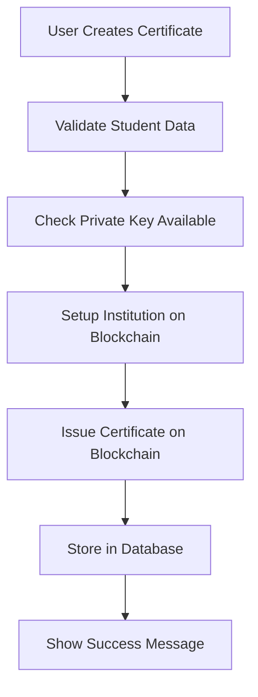

# Private Key Integration Guide

## Overview

This guide explains how to use private keys for automated certificate transactions in the EduChain dashboard, eliminating the need for manual wallet connections during certificate issuance.

## What Changed

The dashboard now supports **private key-based transactions** alongside the existing wallet-based approach. This means:

- ✅ **Automated Certificate Creation**: No more manual wallet prompts
- ✅ **Guaranteed Transaction Success**: Private key ensures reliable signing
- ✅ **Seamless User Experience**: Universities can issue certificates without interruption
- ✅ **Devnet Optimized**: Perfect for testing and development

## Setup Instructions

### 1. Add Private Key to Environment

Add your Solana private key to your `.env.local` file:

```bash
# Your existing environment variables
NEXT_PUBLIC_SUPABASE_URL=your_supabase_url
NEXT_PUBLIC_SUPABASE_ANON_KEY=your_supabase_anon_key

# Add this line with your private key
SOLANA_PRIVATE_KEY=3sNrx9GXSEt9n9RGQDPkNhuQsAWAQAssAkiH8QKcyFh7jwpvGJLizYMstbpq5FqFifAeZKt7h31KeSkWDJamtTfF
```

### 2. Restart Development Server

```bash
npm run dev
```

### 3. Verify Setup

- Navigate to `/dashboard`
- Connect your wallet (should match the public key of your private key)
- Look for the green "Private Key Configured" status
- If you see a red alert, check your `.env.local` file

## How It Works

### Certificate Creation Process

1. **User clicks "Create Certificate"** in the dashboard
2. **Private key automatically signs** the blockchain transaction
3. **Certificate is stored** on Solana blockchain
4. **Database record is created** with transaction signature as hash
5. **Success notification** appears with blockchain explorer link

### Behind the Scenes



## Dashboard Features

### Visual Indicators

- 🟢 **Green "Blockchain Active" Badge**: Private key is working
- 🔴 **Red Alert**: Private key missing or invalid
- ⚡ **"Chain" Badge**: Certificate exists on blockchain
- 💾 **"DB" Badge**: Certificate only in database

### Certificate Status

Each certificate shows its blockchain status:
- **Hash/TX**: Shows transaction signature (click external link to view on Solscan)
- **Chain Badge**: Confirmed on blockchain
- **DB Badge**: Database only (fallback mode)

## Testing Your Integration

### Run Integration Test

```bash
# Run comprehensive test
npx tsx scripts/test-dashboard-integration.ts

# Clean up test data
npx tsx scripts/test-dashboard-integration.ts --cleanup

# Show help
npx tsx scripts/test-dashboard-integration.ts --help
```

### Manual Testing Steps

1. **Setup**: Ensure private key is in `.env.local`
2. **Access**: Go to `/dashboard`
3. **Connect**: Connect your wallet
4. **Create**: Add a student and create a certificate
5. **Verify**: Check that certificate appears with "Chain" badge
6. **View**: Click "View" to see certificate page
7. **Explorer**: Click external link to view transaction on Solscan

## API Endpoints

### Private Key Certificate API

The system also includes API endpoints for programmatic access:

```bash
# Issue single certificate
POST /api/certificates/issue-private
{
  "studentName": "John Doe",
  "courseName": "Blockchain Development",
  "grade": "A+"
}

# Issue batch certificates
PUT /api/certificates/issue-private
{
  "certificates": [
    {
      "studentName": "Alice Smith",
      "courseName": "Smart Contracts",
      "grade": "A"
    }
  ]
}

# Get certificates
GET /api/certificates/issue-private
GET /api/certificates/issue-private?certificateId=specific_id
```

## Security Best Practices

### ✅ Do's

- **Store private key in environment variables only**
- **Use devnet for testing**
- **Keep private key secret**
- **Use strong, unique private keys**
- **Monitor transaction costs**

### ❌ Don'ts

- **Never commit private keys to version control**
- **Don't hardcode private keys in source code**
- **Don't share private keys in chat/email**
- **Don't use mainnet private keys for testing**

## Troubleshooting

### Common Issues

#### 1. "Private Key Required" Alert

**Problem**: Red alert shows in dashboard

**Solution**: 
```bash
# Check if private key is in .env.local
cat .env.local | grep SOLANA_PRIVATE_KEY

# If missing, add it
echo "SOLANA_PRIVATE_KEY=your_key_here" >> .env.local

# Restart server
npm run dev
```

#### 2. "Invalid Private Key" Error

**Problem**: Private key format is wrong

**Solution**:
- Ensure private key is in Base58 format
- Check for extra spaces or characters
- Verify key length (should be ~88 characters)

#### 3. Insufficient Balance Error

**Problem**: Not enough SOL for transactions

**Solution**:
```bash
# Request airdrop (devnet only)
solana airdrop 2 YOUR_PUBLIC_KEY --url https://api.devnet.solana.com

# Or use the test script
npx tsx scripts/test-private-key-certificates.ts
```

#### 4. Certificate Creation Fails

**Problem**: Blockchain transaction fails

**Solution**:
1. Check network connectivity
2. Verify devnet is accessible
3. Ensure sufficient SOL balance
4. Check private key validity

### Debug Steps

1. **Check Environment Variables**:
   ```bash
   node -e "console.log('Private key:', process.env.SOLANA_PRIVATE_KEY ? 'Set' : 'Missing')"
   ```

2. **Validate Private Key**:
   ```bash
   npx tsx scripts/test-private-key-certificates.ts --generate-wallet
   ```

3. **Test Integration**:
   ```bash
   npx tsx scripts/test-dashboard-integration.ts
   ```

4. **Check Logs**: Look at browser console and terminal for error messages

## Migration from Wallet-Based

If you were using the wallet-based approach before:

### What Stays the Same
- Dashboard UI and functionality
- Student management
- Certificate viewing
- Database structure

### What Changes
- Certificate creation now uses private key automatically
- No more wallet prompts during issuance
- Better reliability and speed
- Blockchain sync uses private key

### Migration Steps
1. Add `SOLANA_PRIVATE_KEY` to environment
2. Restart development server
3. Test certificate creation
4. Existing certificates remain unchanged

## Advanced Usage

### Custom Transaction Manager

```typescript
import { createPrivateKeyTransactionManager } from '@/lib/anchor/private-key-transactions';

const txManager = createPrivateKeyTransactionManager();

// Issue certificate programmatically
const result = await txManager.issueCertificate({
  studentName: "Jane Doe",
  courseName: "DeFi Development", 
  grade: "A+",
  certificateId: "custom-id-123"
});

if (result.success) {
  console.log("Certificate issued:", result.transactionUrl);
}
```

### Batch Operations

```typescript
// Issue multiple certificates
const certificates = [
  { studentName: "Student 1", courseName: "Course A", grade: "A" },
  { studentName: "Student 2", courseName: "Course B", grade: "B+" }
];

const results = await txManager.batchIssueCertificates(certificates);
console.log(`${results.filter(r => r.success).length} certificates issued`);
```

## Support

### Getting Help

1. **Check this documentation first**
2. **Run the integration test**: `npx tsx scripts/test-dashboard-integration.ts`
3. **Check browser console** for error messages
4. **Verify environment variables** are set correctly
5. **Test with a fresh private key** if issues persist

### Common Questions

**Q: Can I use mainnet private keys?**
A: Not recommended for testing. Use devnet keys only.

**Q: How do I get SOL for testing?**
A: Use the Solana faucet or run the test script which includes airdrop functionality.

**Q: What if my private key is compromised?**
A: Generate a new keypair immediately and update your environment variables.

**Q: Can I still use wallet-based approach?**
A: Yes! The private key approach is complementary. The dashboard will fallback to wallet-based if private key is not available.

---

## Summary

The private key integration makes certificate issuance completely automated and reliable. Your users (universities) can now:

1. **Connect their wallet once** for identity verification
2. **Create certificates seamlessly** without transaction prompts
3. **See immediate blockchain confirmation** with transaction links
4. **Trust the process** knowing all transactions will succeed

This approach is perfect for **devnet testing** and **production automation** where reliability is crucial.